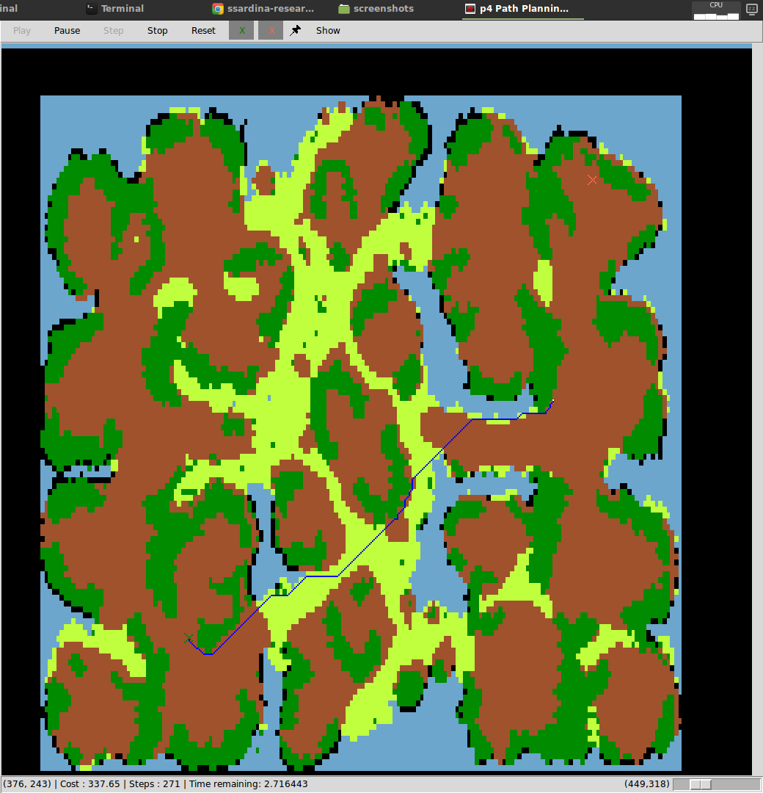
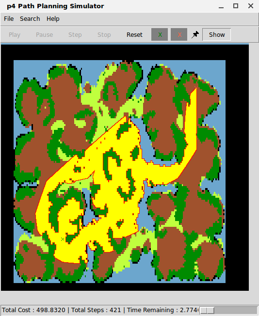

# p4 - Python Path Planning Project

**p4 (aka the "Python Path Planning Project** is a Python-based path planning framework and simulator, useful to prototype, evaluate, and benchmark path planning algorithms. 

The system began as a Python version of the Java-based [APPARATE path-planning simulator](https://github.com/ssardina-planning/apparate-simulator) to be able to prototype algorithms in a "lighter" programming language. It started as part of Peta Masters' 2013 programming course project and then extended to support her Honours thesis and doctorate program, under the supervision of A/Prof. Sebastian Sardina.

The p4 simulator relies on maps in the [Movingai](htpp://www.movingai.com) format. Run with GUI, to observe their operation, without GUI to obtain cost, steps and time-taken, or in auto mode to output `csv` files of accumulated results from map problems in `.scen` format (also from Movingai).

The p4 system has been used in the our [Goal Recognition in Path Planning AAMAS'17](https://dl.acm.org/citation.cfm?id=3091232) and the [Deception in Path Planning IJCAI'17](https://www.ijcai.org/proceedings/2017/610) papers. 

This [dedicated GR fork](https://github.com/ssardina-planning/p4-simulator-gr) of this repo for the extensions to p4 related to those works; check the sub-folders:

* For p4 in Goal Recognition in Path Planning see [here](https://github.com/ssardina-planning/p4-simulator-gr/tree/master/src/GR).
* For p4 in Deception in Path Planning see [here](https://github.com/ssardina-planning/p4-simulator-gr/tree/master/src/DPP).

Check some screenshots of p4: 
[screenshot 1](docs/screenshots/screenshot01.png) -
[screenshot 2](docs/screenshots/screenshot02.png) -
[screenshot 3](docs/screenshots/screenshot03.png) -
[screenshot 4](docs/screenshots/screenshot04.png)

-----------------------
- [p4 - Python Path Planning Project](#p4---python-path-planning-project)
  - [Prerequisites](#prerequisites)
  - [Features](#features)
  - [Director Structure](#director-structure)
  - [Configurations & Options](#configurations--options)
    - [Config file](#config-file)
    - [Cost model](#cost-model)
    - [Batch mode](#batch-mode)
    - [Timing the agent](#timing-the-agent)
  - [Examples](#examples)
  - [Interrogate Model Outside Simulator](#interrogate-model-outside-simulator)
  - [Batch and Profiling (Unix only)](#batch-and-profiling-unix-only)
  - [Technical Information](#technical-information)
  - [Contributors and Contact](#contributors-and-contact)
  - [License](#license)
  - [Screenshots](#screenshots)

## Prerequisites

* Python 3.8+
* Tkinter - Writing Tk applications with Python
  * Linux package ``python-tk`  or pip module `tk`
* Map in [Movingai](htpp://www.movingai.com) with extensions for cost modelling.

## Features

* Run from CLI (for benchmarking) or with GUI interface (for visualisation and debugging).
* Compatible with [Movingai](htpp://www.movingai.com) map format with extensions for cost and dynamic changes (see below)
* Dynamic changes to map via map scripts (see below).
* Deadline specification (agent is terminated at deadline).
* Report of cost, steps, total and remaining time.
* Batch mode `-batch` for running group of scenarios (`.scen` format) and exporting stats to `csv` file.
* Different cost models: mixed, mixed-real, mixed-opt2.

## Director Structure

Supplied Files include:

* `docs/`: Documentation (not maintained beyond V2)
* `maps/`: Default map location
* `src/`: All source code for simulator
    * `src/agents/`:  Default agent location

## Configurations & Options

### Config file

`CFG_FILE`: Configuration file with all settings as Python variables and includes information such as what map and search algorithm to use. 

See `config.py` for expected format.

If `config_file` or file path not supplied, looks for default `config.py`.

### Cost model

This is the cost model when using mixed-cost grids:

* `mixed` (DEFAULT): one used in the contest using sqrt(2) for diagonals.
* `straight`: moves are `1*cost` of destination.
* `diagonal`: moves are `sqrt(2)*cost` of destination.
* `mixed-real`: full center-to-center cost between source and destination cell.
* `mixed-opt1`: like mixed but optimized to 1.5.
* `straight`: moves are `1*cost` of destination.
* `diagonal`: moves are `1.5*cost` of destination.
* `mixed-opt2`: like mixed but optimized to 1.5*2.  

Straight moves are 2 x cost of destination

Diagonal moves are 3*cost of destination

### Batch mode

Batch mode, via `--batch`, allows to read and run problems from a `.scen` file and outputs results to the `OUT_FILE` in CSV format.

It can optionally take an integer `reps` for the number of repetitions across, which test times are to be averaged.

* The `<SCEN_FILE>` MUST be in [Movingai](https://movingai.com/benchmarks/mapf/index.html) scenario file format.  
* The map to be used must be in the same directory as the `<SCEN_FILE>` and its name is the prefix up to `.map` included. For example, if the `<SCEN_FILE>`  is `../maps/bgmaps/AR0011SR.map.aopd.scen`, then the map to be used will be file `../maps/bgmaps/AR0011SR.map`.
* The map names inside the `.scen` file will be ignored.

### Timing the agent

There are a few options that influence the timing of the agent:

* `-rt` or `--realtime`: take into account the time of every single move of the agent. Otherwise, the system will time just the first step, in which the agent did the actual search. This option is useful when dealing with reactive agents or an agent reasoning at every step.
* `-f FREE_TIME` or `--free FREE_TIME`: steps taking less than `FREE_TIME` will not be counted towards the total time taken. This could be useful if we want to ignore reactive steps, for example.
* `-d DEADLINE` or `--deadline DEADLINE`: the total amount of time at disposal for the agent
  
## Examples

All run from folder `src/`.

To see the options:

```bash
$ python p4.py --help
```

Run from customised config file and ASTAR in uniform cost with a deadline of 4 seconds:

```bash
$ python p4.py config.py
Total Cost : 510.416305603 | Total Steps : 440 | Time Remaining : 19.519 | Total Time : 0.48086

$ python p4.py
```

Run by providing a map, start and goal locations, deadline, and agent to use:

```shell
$ python p4.py -m ../maps/bloodvenomfalls.map -s 128,405 -g 403,93 -d 4 -a agent_astar
Total Cost : 498.8320 | Total Steps : 421 | Time Remaining : inf | Total Time : 1.258769
```

Interpreting the results:

* _`Total Cost`_: total cost of the solution path; costs may be non-uniform and diagonal moves cost more than straight moves
* _`Total Steps`_: number of steps that the path takes
* _`Time Remaining`_: time left to deadline given
* _`Total Time`_: time taken (Total Time + Time Remaining = Deadline)


Run the GUI with a random agent:

```shell
$ python p4.py -m AR0306SR.map  -s 218,110 -g 444,386 -a agent_random  -e euclid -d 20 -gui
```

Run with mixed cost:

```shell
$ python p4.py -m ../maps/bloodvenomfalls.map -c ../maps/mixedcost/G1-W5-S10.cost -s 128,405 -g 403,93 -a agent_astar
```

Run a BATCH of scenarios described in `AR0011SR.map.scen`, write results in file `astar_batch.csv`, each problem is run 3 times (and time averaged across):

```shell
$ python p4.py -batch ../maps/bgmaps/AR0011SR.map.scen astar_batch.csv 3 -a agent_astar
```

**Note:** if there's a difference between 'optimum' and astar 'actual', check SQRT2 definition in `p4_utils`.

Output is in CSV format: `cost;steps;time_taken;time_remaining`, e.g:

```csv
187.13708499;154;0.32759;19.672
```

## Interrogate Model Outside Simulator

In the `src/` directory run the Python interpreter:

```python
>>>import p4_model as m
>>>l = m.LogicalMap("../maps/mixedcost3.map")   #or other existing map
>>># now you can interrogate the model, e.g...
>>>l.getCost((0,0))                         #note double brackets
```

## Batch and Profiling (Unix only)

Profile a run:

* `-s time`: sorts by total time (without taking internal calls)
* `-s comulative`: sorts by cumulative time (taking all internal calls into account)

```shell
$ python -m cProfile p4.py -s time -m ../maps/AR0306SR.map  -s 218,110 -g 444,386 -a agent_astar -e euclid -d 20
```

Run it 10 times and get the average time:

```shell
$ run 10 /usr/bin/python  p4.py -m ../maps/AR0306SR.map  -s 218,110 -g 444,386 \
        -a agent_jps_inv -e euclid -d 20 | grep Cost | awk '{total += $19} END {print total/10}'
```

Function `run()` should be defined (e.g., in `.bashrc`) as follows:

```bash
run() {
    number=$1
    shift
    for i in `seq $number`; do
        bash $@
    done
}
```

## Technical Information

* By default, algorithms are timed using `time.clock()`. Switch to `time.time()` by resetting the global variable in `p4_utils.py`. 
* `p4_utils` also controls colors used to display returned lists. 
* `p4_utils.py` provides settings and `p4_model.py` presents an interface you can interrogate when implementing your own `agents/` algorithms. 
* if there's a difference between 'optimum' and astar 'actual', check SQRT2 definition in `p4_utils`.

## Contributors and Contact

* Peta Masters
* Sebastian Sardina

## License

This project is using the GPLv3 for open source licensing for information and the license visit GNU website (https://www.gnu.org/licenses/gpl-3.0.en.html).

This program is free software: you can redistribute it and/or modify it under the terms of the GNU General Public License as published by the Free Software Foundation, either version 3 of the License, or (at your option) any later version.

This program is distributed in the hope that it will be useful, but WITHOUT ANY WARRANTY; without even the implied warranty of MERCHANTABILITY or FITNESS FOR A PARTICULAR PURPOSE. See the GNU General Public License for more details.

You should have received a copy of the GNU General Public License along with this program. If not, see http://www.gnu.org/licenses/.

----------------------------

## Screenshots

Blue agent navigating to destination:



After arrival, area searched (closed list) is shown in yellow:



A random agent:


Use via terminal to do batch testing (many scenario problems in one map):

